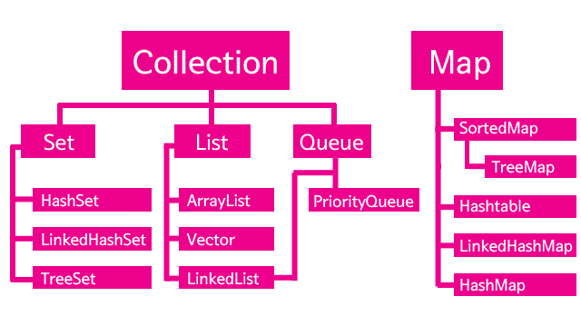

###  Java 2. Collection Framework

자바 컬렉션 프레임워크는 같은 타입의 객체들을 모아서 담아두는 자바 API 클래스들의 모음이다.
 
컬렉션에 포함되어 있는 각 클래스마다 객체를 담거나 꺼내는 메소드를 제공하며 기본적으로 Set, Map, List등 3가지 유형으로 분류할 수 있다.
 
Set은 중복된 객체를 넣을 수 없고, Map은 키(Key)와 값(value)의 쌍(pair)을 담는다. List는 객체를 순서대로 담을 수 있으면서 중복된 객체를 담을 수 있다.(Set은 저장된 객체에 순서를 부여하지 않는다.)

| 인터페이스 | 특징|
|----------|--------|
|LIST| 순서가 있는 데이터의 집합 ==데이터의 중복 허용== >>데이터를 넣으면 순차적으로 데이터가 들어간다. 각각의 저장되어 있는 공간들은 고유한 인덱스를 갖는다. |
|Set| 순서를 유지하지 않는 데이터의 집합, ==데이터의 중복을 허용하지 않는다 == >> 수학적 개념으로 집합 데이터가 순서와 상관없이 add된다. |
|Map| Key, Value 쌍으로 이루어진 데이터의 집합 순서는 유지되지 않으며, Key는 중복을 허용하지 않으나 Value는 중복을 허용한다.	|