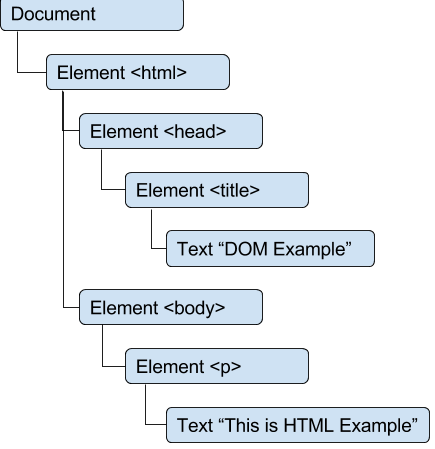

### JavaScript 1. DOM

```{.htmjl}
<html>
	<head>
    <title></title>
    </head>
    <body>
    <p>This is HTML Exaple</p>
    <body>
</html>
```

HTML 문서를 계층 구조로 표현



Document 노드는 각 문서를 루트로 표현
Document 노드의 자식은 <html> 요소 하나뿐인데 이를 '문서요소'라고 부른다<br>

<font size="4">
Node Type
</font>

Dom 레벨 1에는 Node라는 인터페이스가 있는데 DOM에 존재하는 노드 타입은 모두 이 인터페이스를 구현<br>
자바스크립트의 노드 타입은 모두 Node를 상속하므로 모든 노드 타입에서 같은 기본 프로퍼티와 메서드를 공유.


