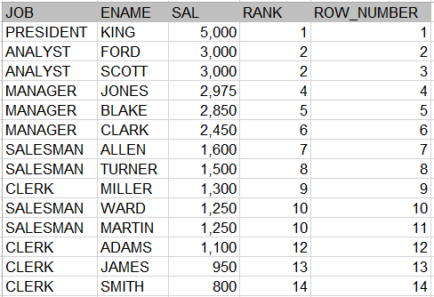

### Oracle 1. Group Function

##### 데이터 분석을 이한 세 가지 함수를 정의
- AGGREGATE FUNCTION 
  COUNT, SUM, AVG, MAX MIN등의 집계 함수
- GROUP FUNCITON - ROLLUP, CUBE
  결산 업무를 가지는 원가나 판매 시스템의 경우 소, 중, 합계 등
  여러 레벨의 결산 보고서를 만들 때 유용
  소그룹 간의 소계를 계산하는 ROLLUP함수 GROUP BY 항목간 다 차원적 소계를 계산할 수 있는 CUBE 함수
  특정 항목에 대한 소계를 계산하는 GROUPING SETS 함수가 있다.
  
- WINDOW FUNCTION
  컬럼과 컬럼간의 연산, 비교, 연결이나 집합에 대한 집계는 쉬운 반면 행과 행간의 관계를 정의 하거나, 
  비교, 연산하는 것은 어려운 문제였음.INLINE VIEW를 이용해 복잡한 SQL문을 작성해야 하던 것을
  부분적이나마 행과 행간의 관계를 쉽게 정의하기 위해 만든 함수이다.
  
  Function의 종류
  1. 그룹 내 순위(RANK) - RANK, DENSE_RANK, ROW_NUMBER
  2. 그룹 내 집계(AGGREGATE) - SUM, MAX, MIN, AVG, COUNT
  3. 그룹 내 행 순서 관련 함수 - FIRST_VALUE, LAST_VALUE, LAG, LEAD
  4. 그룹 내 비율 관련 함수 - CUME_DIST, PERCENT_RAN, NTILE, RATIO_TO_REPORT

- - -

```{.sql}
WINDOW FUNCTION SYNTAX
OVER 문구가 키워드로 필수 포함된다.

SELECT WINDOW_FUNCTION (ARGUMENTS) OVER
([PARTION BY 컬럼] [ORDER BY 절] [WINDOWING 절])
FROM 테이블 명;

- WINDOW FUNCTION 
  기존에 사용하던 함수도 있고, 새롭게 WINDOW 함수용으로 추가된 함수도 있다.
- ARGUMENTS(인수)
  함수에 따라 0 ~ N개의인수가 지정될 수 있다.
- PARTION BY 절
  전체 집합을 기준에 의해 소그룹으로 나눌 수 있다.
- WINDOWING 함수의 대상이 되는 행 기준의 범위를 강력하게 지정
  ROWS는 물리적인 결화 행의 수를, RANGE는 논리적인 값에 의한 범위를 나타냄 둘중 하나 이용
```

######1. 그룹내 순위 함수
```language
가. RANK 함수
RANK함수는 ORDER BY를 포함한 Query 문에서 특정 항목(컬럼)에 대한 순위를 구하는 함수
이때 특정 범위(PARTITION) 내에서 순위를 구할 수도 있고 전체 데이터에 대한 순위를 구할 수도 있다.
또한 동일한 값에 대해서는 동일한 순위를 부여한다. 

SELECT job,
       ename,
       sal,
       RANK () OVER (ORDER BY sal DESC) all_rank,
       RANK () OVER (PARTITION BY job ORDER BY sal DESC) job_rank
  FROM emp; 
  
하나의 SQL 문장에 ORDER BY SAL DESC 조건과 PARTITION BY JOB 조건이 충돌이 났기 때문에
JOB별로는 정렬되지 않고 ORDER BY SAL DESC조건으로 정렬 되었다.
```


---
```language
나. DESNSE RANK 함수
DENSE_RANK 함수는 RANK 함수와 흡사하나, 동일한 순위를 하나의 건수로 취급하는 것이 틀림

SELECT job,
       ename,
       sal,
       RANK () OVER (ORDER BY sal DESC) RANK,
       DENSE_RANK () OVER (ORDER BY sal DESC) dens_rank
  FROM emp;
```

---

```language
다. ROW_NUMBER 함수
ROW_NUMBER 함수는 RANK나 DENSE_RANK 함수가 동일한 값에 대해서는 동일한 순위를 부여하는데 반해, 
동일한 값이라도 고유한 순위를 부여한다.

SELECT job,
       ename,
       sal,
       RANK () OVER (ORDER BY sal DESC) RANK,
       ROW_NUMBER () OVER (ORDER BY sal DESC) ROW_NUMBER
  FROM emp;

동일한 값에 대해서 매겨지는 순서는 알 수 없다(Oralce의 경우 rowid가 작은 행이 먼저 나옴)
만약 동일한 값에 대한 순서까지 관리하고 싶다면 추가적인 정렬 기준을 정해야된다.
ORDER BY sal DESC, ENAME 
```

